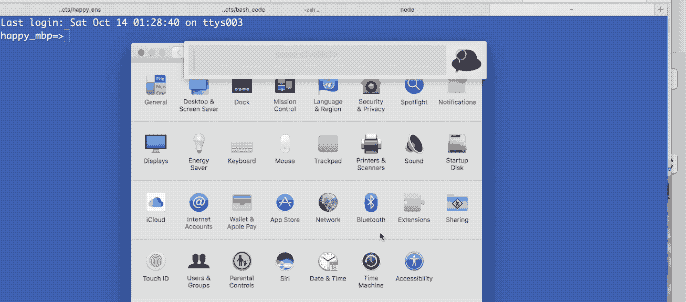

# Welcome to Happy ENS =)

## With Happy ENS you can resolve your mydomain.eth addresses in your browser, without any third-party plugins.

#### Step 1: Update your computers DNS server

- Set your computers DNS server [video](https://github.com/tcsiwula/happy_ens/blob/master/h-ens.gif) to address:***138.197.150.21***

#### Step 2: Register your eth domain with our smart contract

- Go to [happyethereum.com/register](www.happyethereum.com/register) and
associate a mapping of your eth domain to an ipfs resource resolves to your website*

